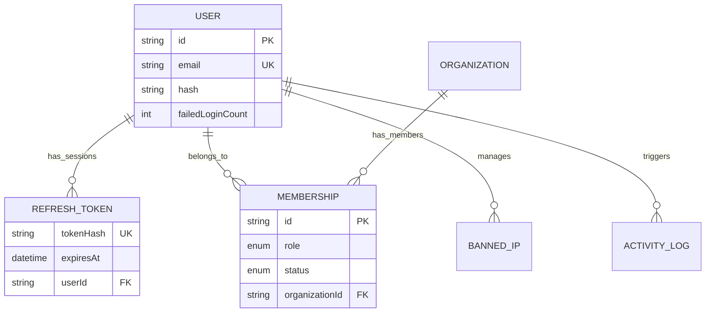
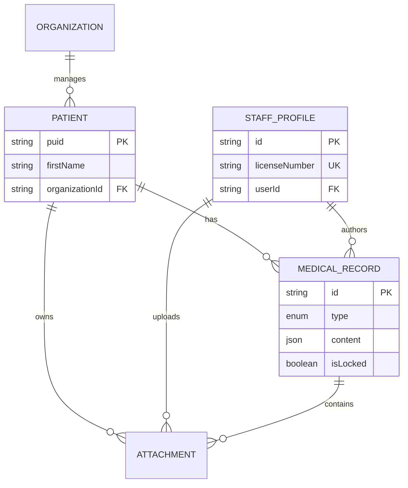
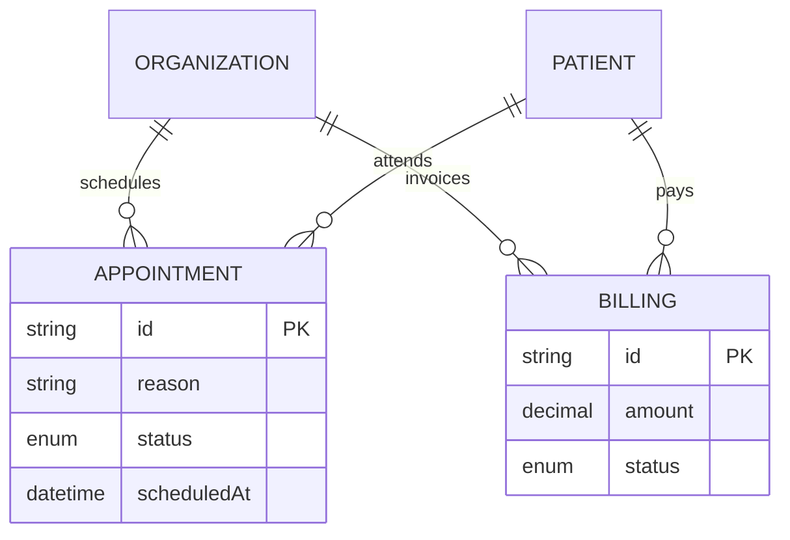
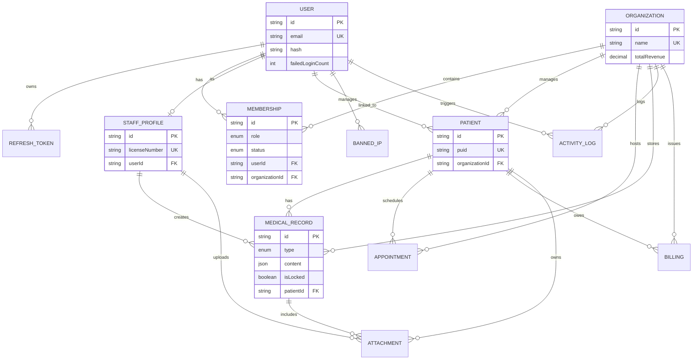
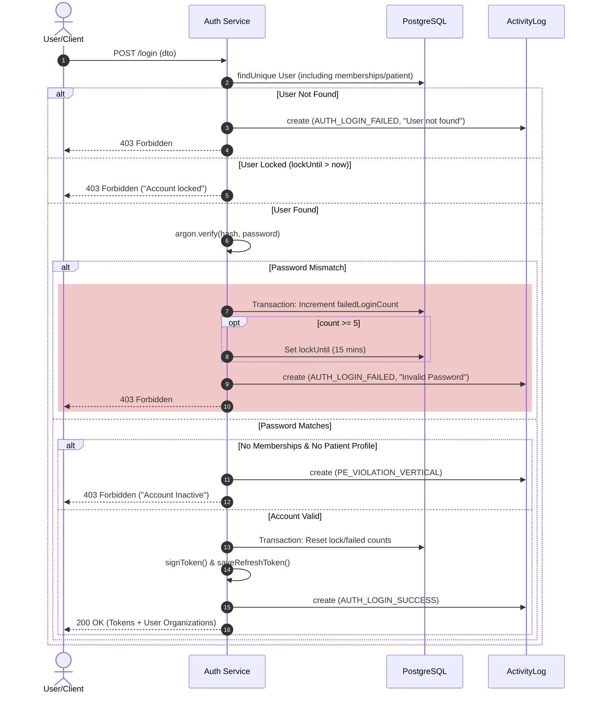
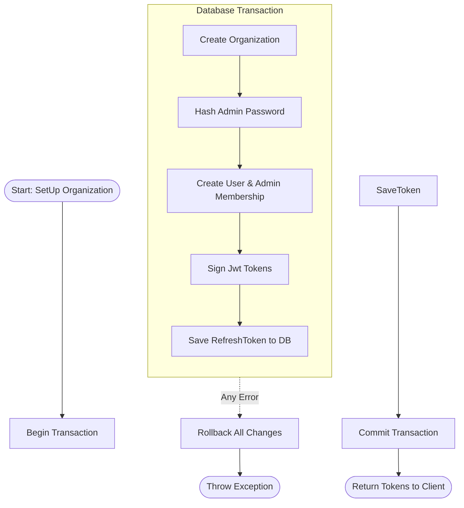

# Healthcare Management System
___
A Multi-Tenant, SaaS, medical records management system, with strong integration of scalability, security and compliance.

---
## Tech Stack

Next JS - Frontend (SSR, CSR and server actions)
Nest JS - Backend ( Security, Scalability and compliance)
Prisma ORM - Schema designing, type-safety, efficient querying
PostgreSQL - Primary database, facilitating structure data, enums, logs, etc.
MinIO - AWS S3 compliant Object storage, Signed URLs, etc.
Docker - Containerization

---
## Features

- Multi-Tenant support - Our platform allows multiple healthcare organization and groups to manage their medical assets
- Multi-role identity - Each entity can be registered separately, for example, John Doe could be doctor at Org A, and patient at Org B, without hassle
- Strict Audit Logging - Every actions, by user(or patient), doctor, staff, admin, etc. will be logged and maintain as a event.
- Strict Hierarchy - We have granular control actions mapped to each entity, no entity can overlap the action other, thus maintaining a strict RBAC decision-driven engine
---
## System Architecture :

### Simplified ER diagram for User Entities



### Simplified ER diagram for Medical Assets



### Simplified ER diagram for Operation and Billing



<details>
<summary>Click here to view full ER diagram</summary>



</details>


### Login Sequence diagram:



### Organization Registration Activity Diagram:




// ADD a Deployment Diagram
___
### Prominent Security Practices :

| Type                       | Description                                                      | Goal                                                                       | Security Context                                         |
| -------------------------- | ---------------------------------------------------------------- | -------------------------------------------------------------------------- | -------------------------------------------------------- |
| JWT tokens                 | Access Tokens(short lived - 15m) Refresh Tokens(Long lived - 7d) | Login Persistence, AUTH checks, etc                                        | Mitigation to Identification and Authentication Failures |
| Argon2                     | Refresh Token Hashing and Password Hashing                       | Encryption at rest, prevention from rainbow table attacks                  | Mitigation for Cryptographic failures                    |
| Http-only Cookie           | Secure handling of JWT Tokens and other sensitive data           | No Javascript tempering, XSS token theft prevention                        | Prevents Injection( XSS based session hijacking)         |
| Nest JS Guards/Interceptor | Strong policy engine fired before and after service logic        | Guards for RBAC enforcement, Interceptors for logging any security anomaly | Prevents Broken Access Control                           |

___
### Notable Security Events :

| Event Type              | Category             | Description                                                                            | Security Context                    |
| ----------------------- | -------------------- | -------------------------------------------------------------------------------------- | ----------------------------------- |
| PE_VIOLATION_HORIZONTAL | IDOR                 | User attempted to access a resource (Patient Record) belonging to another organization | Broker Object Level Authorization   |
| PE_VIOLATION_VERTICAL   | Privilege Escalation | User attempted an action above their role (e.g. Nurse trying to delete a record)       | Broken Function Level Authorization |
| AUTH_SESSION_REVOKED    | Session Management   | A refresh token was manually invalidated by an Admin or system anomaly                 | Token Hijacking Mitigation          |
| SECURITY_IP_BANNED      | Rate Limiting        | Automated Ban triggered by repeated failed logins or rapid-fire requests               | Brute Force / DoS Protection        |
| RECORD_LOCKED           | Integrity            | A medical record is finalized and becomes immutable                                    | Data Integrity                      |

<details>
<summary>All Event Types</summary>

```
  AUTH_LOGIN_SUCCESS
  AUTH_LOGIN_FAILED
  AUTH_LOGOUT
  AUTH_SESSION_REVOKED
  AUTH_PASSWORD_CHANGED
  ADMIN_PASSWORD_CHANGED
  ATTEMPTED_PASSWORD_CHANGE
  NEW_ORGANIZATION_CREATED
  NEW_ADMIN_CREATED
  PATIENT_RECORD_CREATED
  PATIENT_RECORD_UPDATED
  PATIENT_RECORD_LINKED
  MEMBER_CREATED
  MEMBER_STATUS_UPDATE
  PE_VIOLATION_HORIZONTAL
  PE_VIOLATION_VERTICAL
  SECURITY_IP_BANNED
  SECURITY_ANOMALY_DETECTED
  SECURITY_RATE_LIMIT_HIT
  NEW_FILE_UPLOADED
  FILE_UPLOAD_REJECTED
  FILE_DOWNLOADED
  FILE_DOWNLOAD_REJECTED
  FILE_ACCESSED
  FILE_ACCESS_REJECTED
  RECORD_READ_AUTHORIZED
  RECORD_READ_DENIED
  RECORD_LOCKED
  RECORD_UNLOCKED
  RECORD_UPDATE_AUTHORIZED
  RECORD_UPDATE_UNAUTHORIZED
  RECORD_WRITE_AUTHORIZED
  RECORD_WRITE_DENIED
  RECORD_EXPORTED
```

</details>


___
### Progress Report : 

| Module          | Status      | Tech / Security                          |
| --------------- | ----------- | ---------------------------------------- |
| Auth & Identity | Completed   | JWT Rotation, Argon2, RBAC Guards        |
| Multi-Tenancy   | Completed   | Logical Data Isolation, Audit Logging    |
| CI Pipeline     | In-Progress | Github Action(Linting, Build testing)    |
| Attachments     | Planned     | Scanning uploaded files for malware      |
| Microservices   | Planned     | RabbitMQ/BullMQ for clamAV & Heavy tasks |
